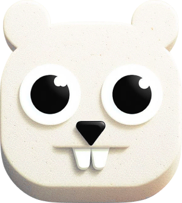

    
    <h2 align="center">Nuga library</h3>
    
Go interface for BYK916 NuPhy® keyboards

    

        
        
    

---

This library provides the ability to control keyboard parameters through the HID USB interface. It is used in [Nuga.app](https://github.com/mishamyrt/nuga-app).

## Terminology

- Mode — keyboard light mode;
- Effect — combination of color, speed, brightness and light mode.

## Protocol

The library is based on reverse-engineering of the keyboard protocol. The knowledge that was obtained is recorded in the [`docs`](./docs/) folder.

## Trademarks

NuPhy® is a registered trademark of NuPhy Studio. Nuga is an unofficial product and is not affiliated with NuPhy Studio.
